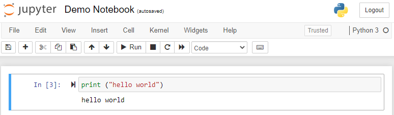
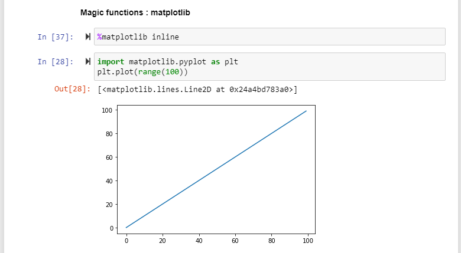
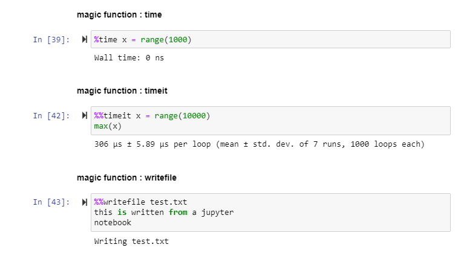

# Data Science with Python

Pluralsight: https://app.pluralsight.com/library/courses/python-data-science

## :notebook: Install Anaconda

Link: https://www.anaconda.com/products/individual

### What is Anaconda?

 Open-source distribution of the Python and R programming languages for scientific computing, that aims to simplify package management and deployment. The distribution includes data-science packages.

## :book: Setting up Jupyter Notebook

- Open Anaconda Prompt
- Run command: jupyter notebook
- Browser will open: http://localhost:8888/tree
- Select New > Python Notebook

## :runner: Execute code in cell

- use "CTRL + ENTER" to execute cell
- use "SHIFT + ENTER" to execute cell and create a new one
- use "ESC + M" to convert cell to markdown
- execute calculations, assign and print variables
- create and execute functions
- use "ESC + L" to add line numbers
- use "!" to execute shell commands on your machine

## :sparkles: Magic functions

- single line start with "%"
- multi-line start with "%%"
- use matplotlib to plot graphs

- measure execution times of operations
- create and write to files

